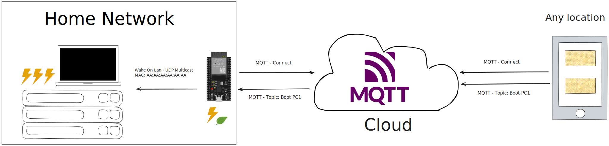

# Wake On Lan MQTT

This project aims to allow booting other systems using Wake on LAN coming from a tiny embedded ESP32-C3 board connected to a MQTT broker hosted in the cloud. The primary goal of this project was to limit the power draw of my homelab, while still allowing remote access to home resources.



This repository contains my setup using an excellent embedded development framework - ESPhome and some other configuration details that I didn't want to be lost. 

## Environment setup

1. Check if Wake On Lan is supported. Enable it in the BIOS on target PC. You can test it with the provided C++ code in `wol.cpp` (tested on Linux) or other tools. 
    - `g++ wol.cpp -o wol`
    - `wol 00:AA:BB:11:22:33`
2. Set up an MQTT broker, the processing requirements are very small for this project.
3. Test the TLS connectivity using provided Python code in `mqtt-test`.
    - `uv sync`
    - Fill missing values in `main.py`
    - `uv run python main.py`
4. Download the TLS certificate of your MQTT broker and copy the text content in PEM format, repeat every few months. Alternatively set `skip_cert_cn_check: true`
5. Create a new file `secrets.yaml` and fill it with correct values for your setup using the provided template `secrets.example.yaml`
6. The main file is `wakeonlanmqtt.yaml` which is the base firmware for the ESP, written in [ESPhome](https://esphome.io/guides/getting_started_command_line.html). It can be compiled and uploaded using
    ```bash
    docker run --rm --privileged -v "${PWD}":/config --device=/dev/ttyUSB0 -it ghcr.io/esphome/esphome run wakeonlanmqtt.yaml
    ```
7. Download [DroidPad](https://github.com/umer0586/DroidPad) and import the template or use any other MQTT client software to send boot messages from your device. 

## References

- [ESPhome docs](https://esphome.io/components/mqtt.html)
- MQTT:
    - Self-hosted - [Mosquitto](https://hub.docker.com/_/eclipse-mosquitto)
    - Managed Cloud offerring with totally sufficient free tier [HiveMQ](https://www.hivemq.com/products/mqtt-cloud-broker/)
- ESP32 board I chose (avoid if possible, but it does work)
    - <https://pl.aliexpress.com/item/1005007446928015.html>
    - <https://sigmdel.ca/michel/ha/esp8266/super_mini_esp32c3_en.html>
    - <https://github.com/sigmdel/supermini_esp32c3_sketches>
    - <https://github.com/sidharthmohannair/Tutorial-ESP32-C3-Super-Mini>
    - <https://dl.artronshop.co.th/ESP32-C3%20SuperMini%20datasheet.pdf>
- Wireguard on ESP32 (unused in this project):
    - <https://github.com/pirate/wireguard-docs>
    - <https://github.com/ciniml/WireGuard-ESP32-Arduino>
    - <https://github.com/trombik/esp_wireguard>


## Other ideas

Boot over VPN - allow booting a desktop PC using Wake on LAN coming from a tiny embedded ESP32-C3 board connected to a Wireguard VPN. Scrapped due to connectivity problems on my esp

